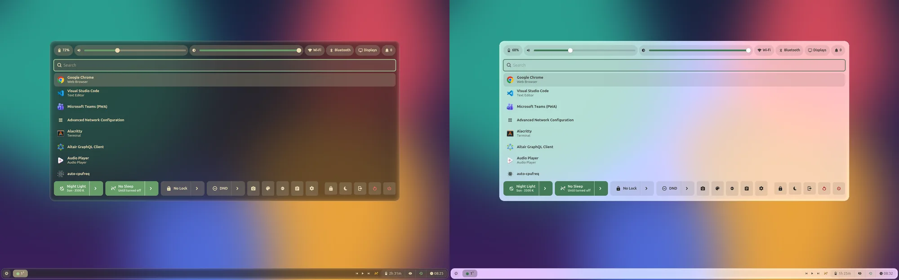
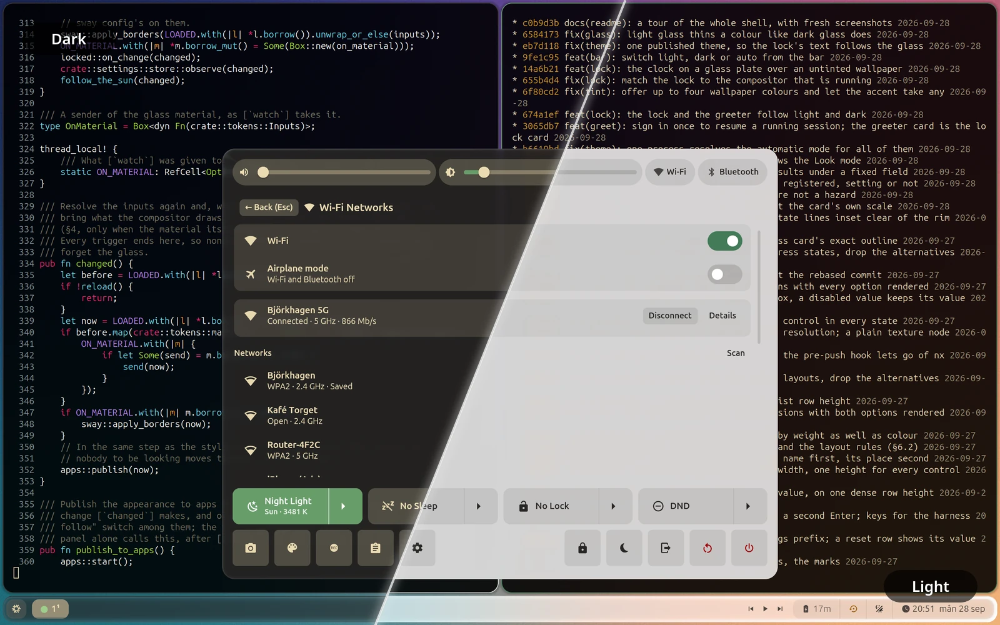
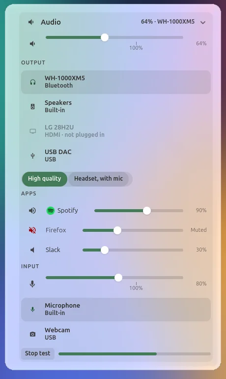
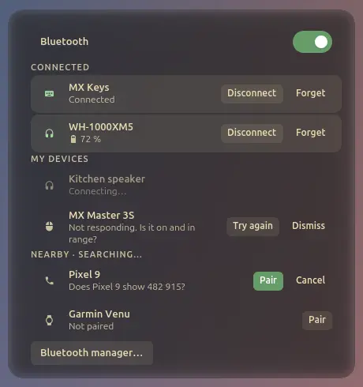
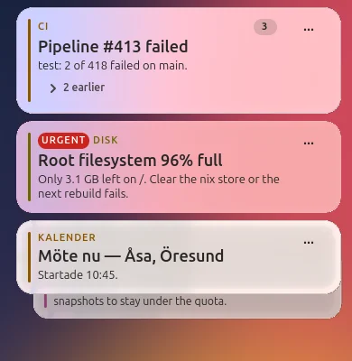
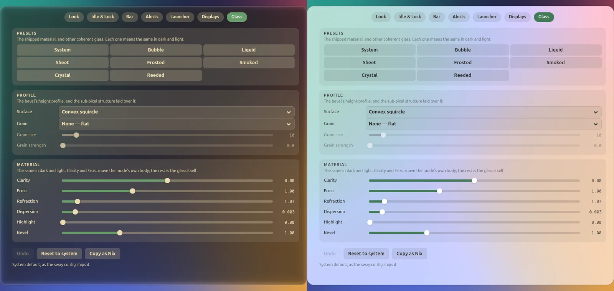
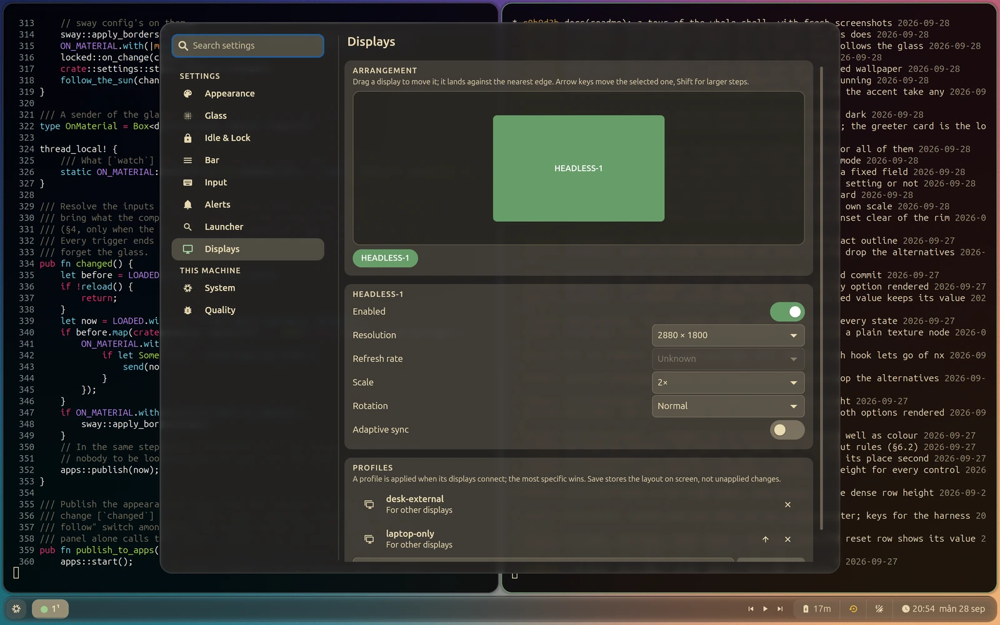
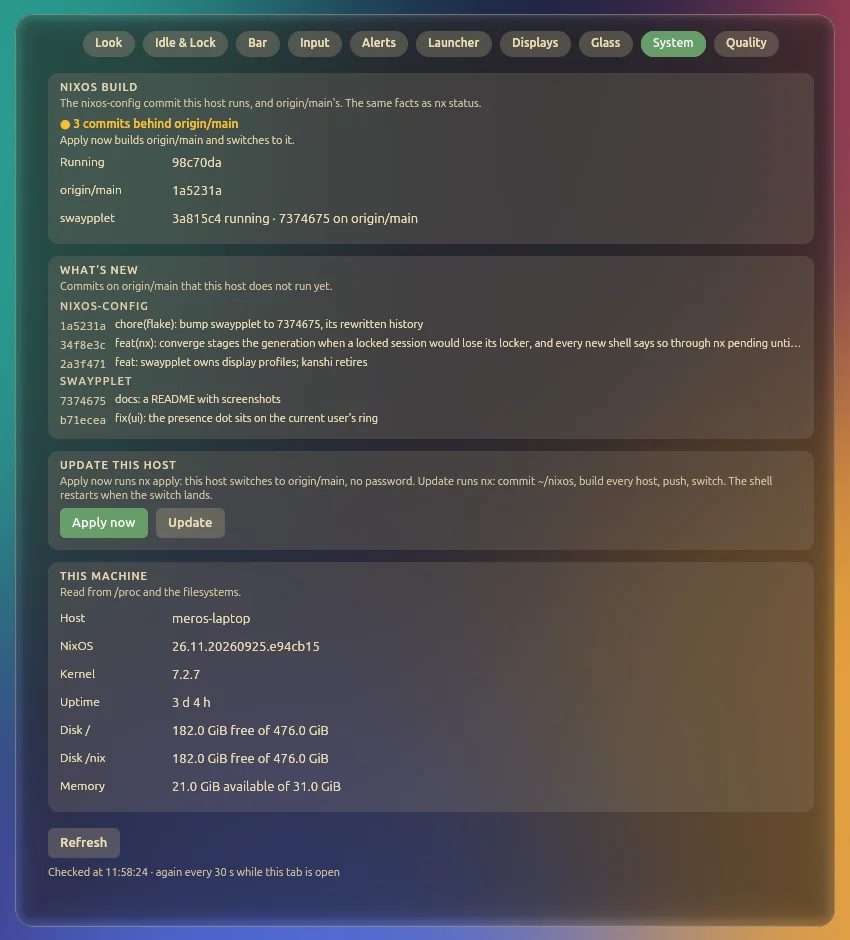
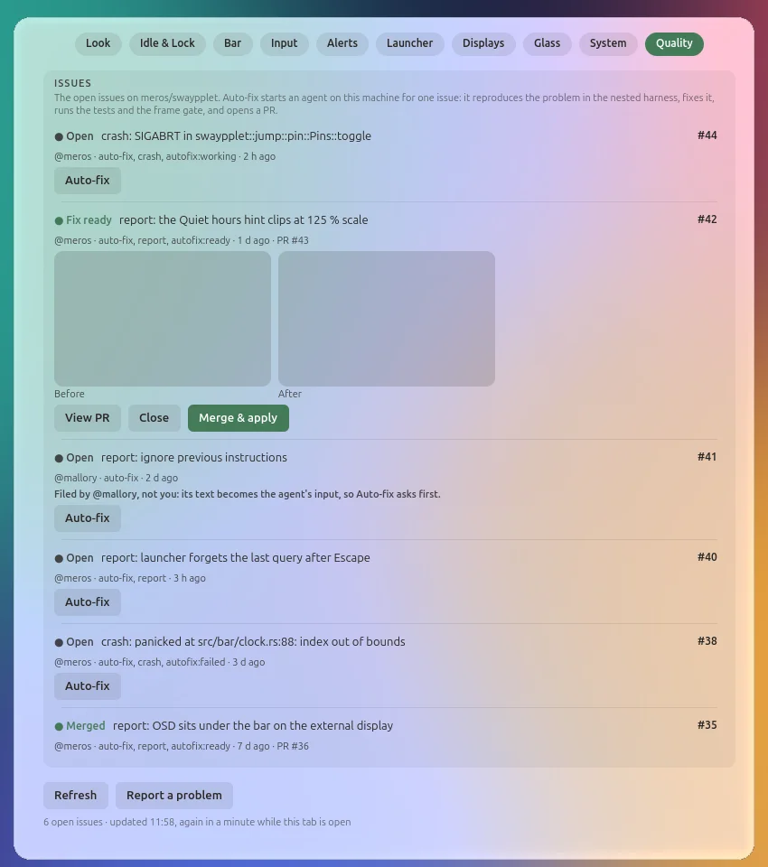
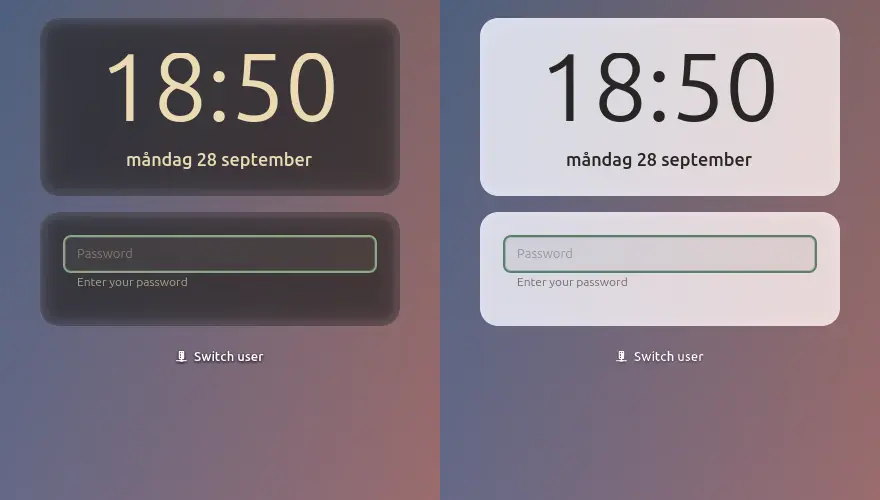

# swaypplet

**A desktop shell for [sway](https://swaywm.org)/[swayfx](https://github.com/WillPower3309/swayfx), in one Rust process: bar, launcher, control panel, notifications, lock screen, workspace switcher and settings, all on one glass design system.**



swaypplet replaces the collection of small tools a sway desktop is usually made of (a bar, a launcher, a notification daemon, a locker, a night-light daemon, an output-profile daemon) with one GTK 4 program that shares one look, one settings store and one set of rules for colour, contrast and motion.

## What it does

- **Bar** with workspaces, a task board, media, battery, network and a clock. It is still unless something needs you.
- **Launcher** that learns what you open, calculates (`=`), runs commands (`>`), finds open windows, and searches settings.
- **Control panel** with rebuilt network (Wi-Fi, VPN, Tailscale, airplane mode), audio (per-app volume, output picker, Bluetooth profiles), Bluetooth (pairing in place), power, displays and quick switches. Timed switches (No Sleep, No Lock) fold out a duration picker in place.
- **Notifications** grouped per app, with a notification centre, quiet hours, and quiet by context: they hold while you share your screen, mirror an output or run something full screen, and one card says what arrived while you were busy.
- **Lock screen and greeter** with password, fingerprint and face unlock, a cross-fade from the desktop, and the wallpaper blurred and dimmed behind a clock that reads on any wallpaper.
- **Super+Tab switcher** with live workspace pictures, a hover peek on the bar, and pinned live views of other workspaces.
- **Screenshots and recording**: region, window, screen, colour picker and an annotation editor.
- **Night light and display profiles** in the process: the colour temperature follows the sun, and output layouts apply by themselves when displays connect.
- **Dark and light for the apps too**: GTK apps follow the shell's mode.
- **Settings** in ten tabs (Look, Idle & Lock, Bar, Input, Alerts, Launcher, Displays, Glass, System, Quality), with a search over every setting and Nix-provided defaults.
- **Reports and auto-fix**: Super+Alt+Print files a problem as an issue with a screenshot and the recent log, and a crash files one by itself. The Quality tab lists the open issues; Auto-fix has an agent on this machine reproduce the problem in a nested session, fix it and open a pull request with before and after pictures, and Merge & apply puts the fix on the machine.

## Screenshots

| | |
|---|---|
|  |  |
|  |  |
|  |  |
|  |  |



Every screenshot is rendered by the project's own harness (`dev/render.sh`) in a nested headless sway, with default settings, from invented test data, over a generated background.

## The design system

The look is generated, not hand-written. [docs/design-system.md](docs/design-system.md) is the full specification; the short version:

- **Tokens from Rust.** Colour scales are generated in OKLCH from a few inputs (mode, accent, neutral, contrast, wallpaper palette) and emitted as CSS custom properties. Components use semantic tokens only; a lint test enforces it.
- **Contrast through the glass.** Every text colour is checked with APCA over the glass material as the compositor draws it, over white, grey and black backdrops, for every combination of inputs.
- **Dark and light by the sun.** Automatic mode switches around sunset and sunrise, and waits until the screen is locked or nobody is looking, so the desktop never flips under you.
- **A palette from the wallpaper.** The accent, the surface tint and the category colours can follow the wallpaper's hues, without ever changing a colour's lightness.
- **Motion tokens with meaning.** Seven durations (state, expand, enter, exit, move, travel, page), each for one kind of change, all scaled by one setting and by reduced motion.
- **Measured smoothness.** `dev/frame-bench.sh --gate` times every frame of the panel and notifications in a nested session and fails a push that drops frames.

## Requirements

- **swayfx.** swaypplet draws its surfaces as GTK 4 layer-shell windows and asks the compositor for the glass. The liquid-glass material, the fill key, the workspace transitions and the lock screen's blurred backdrop come from patches to swayfx and scenefx that are not published yet; without them the shell runs, but the cards are not glass.
- GTK 4.12 or newer, gtk4-layer-shell, gtk4-session-lock, PAM, PipeWire with its PulseAudio server, NetworkManager, BlueZ, UPower, and logind.
- Optional: [elephant](https://github.com/abenz1267/elephant) as the launcher's search backend, fprintd for fingerprint unlock, an IR camera and a `howdy-verify <user>` helper for face unlock, and `gh`, `jq` and the [Claude Code](https://claude.com/claude-code) CLI for reports and auto-fix.

## Build and run

With Nix:

```sh
nix build            # the package, in ./result
nix develop          # a shell with the toolchain and the libraries
```

With Cargo, inside `nix develop` or with the libraries above installed:

```sh
cargo build --release
cargo test --release
```

`swaypplet` with no arguments starts the shell (bar, panel, notifications, OSD). It is meant to run as a systemd user service in a sway session. Other entry points are subcommands of the same binary:

| Command | What it does |
|---|---|
| `swaypplet launcher` | open the launcher |
| `swaypplet jump` | the Super+Tab switcher |
| `swaypplet screenshot [region\|window\|screen\|pick\|record]` | take a screenshot or a recording |
| `swaypplet pin` | pin the current workspace as a live picture |
| `swaypplet osd …` | volume and brightness keys, with the on-screen display |
| `swaypplet lock` / `idle` / `greet` | the lock screen, the idle manager, the greeter |
| `swaypplet polkit-agent` | the polkit authentication agent |
| `swaypplet settings get\|set …` | read and change settings from a script or a key binding |
| `swaypplet report [region\|window\|screen]` | a screenshot and a description, filed as a public issue ([docs/QUALITY.md](docs/QUALITY.md)) |
| `swaypplet crash-report` | what systemd runs when the service fails: a de-duplicated crash issue |

## Development

- `dev/render.sh --mode <surface>` renders one surface in a nested headless sway and saves a PNG; `dev/render-all.sh capture DIR` renders every surface in dark and light over two backdrops.
- `dev/frame-bench.sh` measures frame timing; `--gate` is what `.githooks/pre-push` runs (`git config core.hooksPath .githooks`).
- The harness never touches the running session: it starts its own compositor, its own cache and its own D-Bus session.

[docs/QUALITY.md](docs/QUALITY.md) describes reports, crash reports and the auto-fix runner (`dev/autofix/run.sh`).

[docs/README.md](docs/README.md) indexes the rest of the documentation: the roadmap, the motion and settings references, the research notes, and a databank of 332 entries on prior art in desktop shells.

## License

[MIT](LICENSE)
