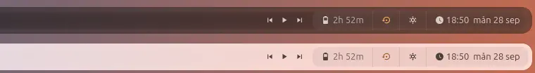
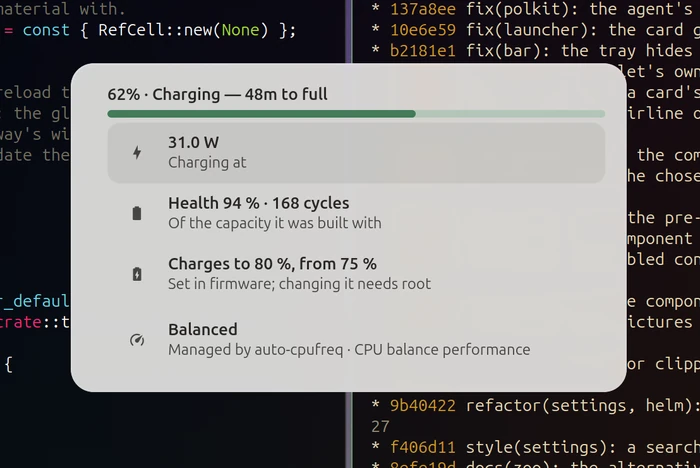
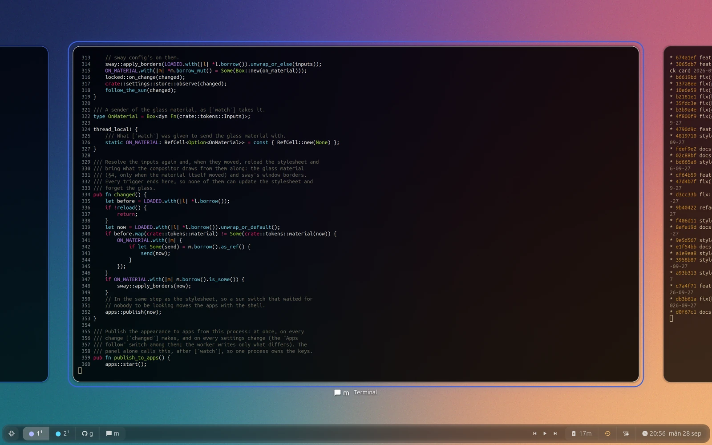
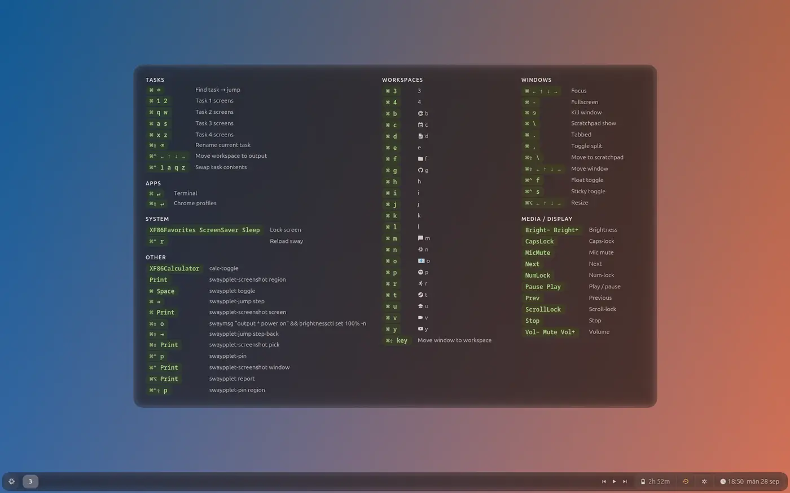
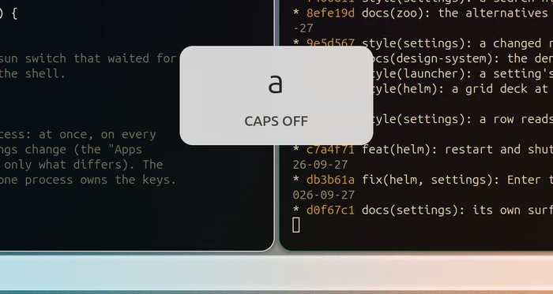
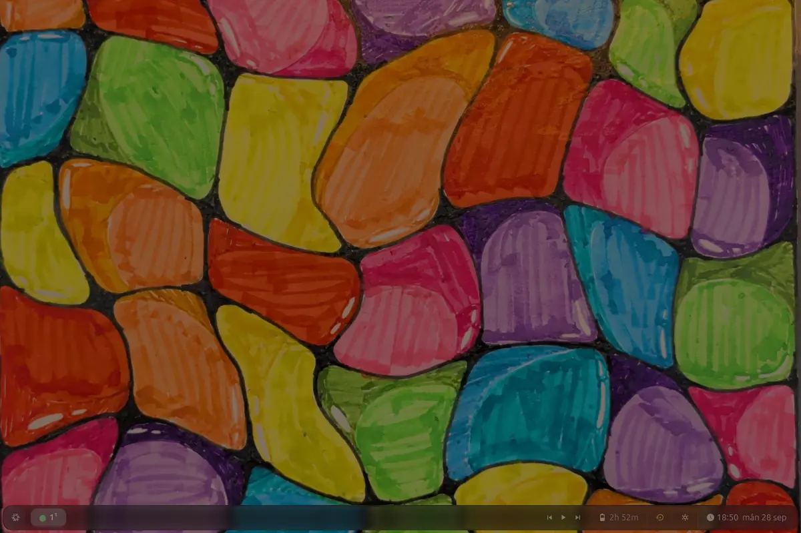
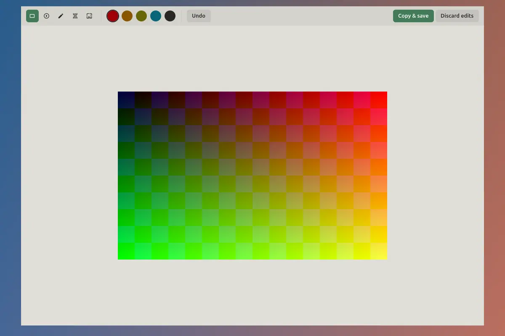
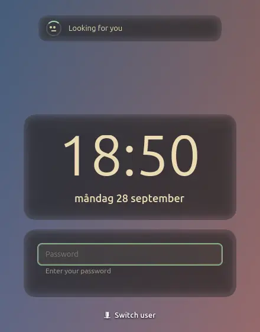
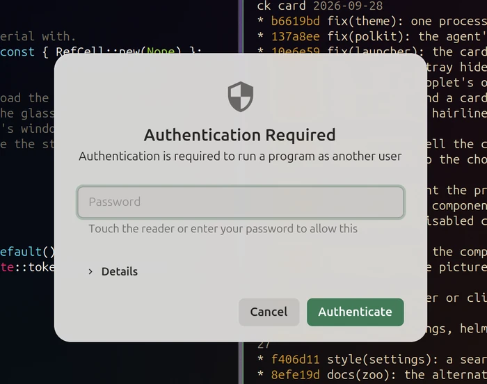

# swaypplet

**A desktop shell for [sway](https://swaywm.org)/[swayfx](https://github.com/WillPower3309/swayfx), in one Rust process: bar, launcher, control panel, notifications, lock screen, workspace switcher and settings, all on one glass design system.**


A sway desktop is usually a set of small tools that each bring their own look and their own config: a bar, a launcher, a notification daemon, a locker, a night-light daemon, an output-profile daemon. swaypplet replaces them with one GTK 4 program. Every surface shares one settings store, one set of colour, contrast and motion rules, and one glass material that the compositor draws.

## A tour

### The bar



The bar is still unless something needs you. On the left are the start button and the workspaces, grouped by the screen they are on. The right end is one segmented track: media, battery, the nightly backup's glyph, the light/dark/auto switch and the clock. A volume or brightness key can show its level in the bar's centre slot instead of as a card. Hovering a workspace shows a live picture of it.

### The control panel and the launcher

The panel (Super+Space, above) is also the launcher: type and it searches apps, open windows and every setting. `=` calculates and `>` runs a command. The results learn what you open. Under the list are the quick switches (Night Light, No Sleep, No Lock, Do Not Disturb), and a timed switch folds out a duration picker in place.

Each tile at the top opens a full page:

| | | |
|---|---|---|
|  |  |  |

- **Network**: Wi-Fi with signal, security and band, saved networks, VPNs, Tailscale with an exit node, airplane mode.
- **Audio**: the output picker, Bluetooth headset profiles, per-app volume, the microphone and a level test.
- **Bluetooth**: connect, forget and pair in place, with the pairing code on the card.



### Switching work: Super+Tab



Super+Tab shows every workspace as a live picture and grows the one you pick to full size. A workspace can be pinned as a small live view in a corner of another. Hold Super for a sheet of every key binding, generated from the sway config that is actually loaded:



### Notifications and the OSD


Notifications group per app and wait in a notification centre. Quiet hours hold them at night, and they also hold by themselves while you share your screen, mirror an output or run something full screen. When you are back, one card says what arrived. The volume and brightness keys show a small card, and Caps Lock says what it did:



### Screenshots and recording

| | |
|---|---|
|  |  |

Region, window, screen, a colour picker and screen recording, from one selector. The annotation editor crops, draws arrows, boxes and highlights, and pixelates what should not be shared, before you save or copy.

### Lock screen, face unlock and authentication


The lock screen shows the wallpaper as it is, with no dimming or blur. The clock and date sit on their own glass plate, so they read on any wallpaper in either mode. Password, fingerprint and face unlock run at the same time, and whichever finishes first unlocks. The lock cross-fades in from the desktop and out again. The greeter at login uses the same card.

| | |
|---|---|
|  |  |

The polkit agent asks for administrator rights on the same card, with the fingerprint reader as an alternative to the password.

### Settings

| | |
|---|---|
|  |  |
|  |  |

Ten tabs (Look, Idle & Lock, Bar, Input, Alerts, Launcher, Displays, Glass, System, Quality), and the launcher searches every setting in them. Nix provides the defaults, and `swaypplet settings get|set` changes any setting from a script or a key binding.

- **Displays** saves output layouts as profiles and applies one by itself when its screens connect.
- **Glass** tunes the material: presets, clarity, frost and the bevel, in both modes at once.
- **Quality** lists the open issues. Super+Alt+Print files a problem with a screenshot and the recent log, and a crash files one by itself. Auto-fix has an agent on this machine reproduce the problem in a nested session, fix it and open a pull request with before and after pictures. Merge & apply puts the fix on the machine.

All the screenshots above come from the project's own harness (`dev/render.sh`): a nested headless swayfx with default settings and invented test data. The panel's app list and the key binding sheet come from the machine that rendered them.

## Why one program

Most of what swaypplet does, a separate tool can do too. What one program adds is agreement: everything on screen comes from the same numbers at the same moment.

- **One theme, one answer.** The panel resolves the theme (dark or light by the sun, the accent, contrast, the wallpaper's hues) and publishes it once. The lock screen, the polkit agent and every other process draw that answer and reload when it changes, and the compositor gets the matching glass from the same answer. The text on a card cannot disagree with the glass behind it.
- **A switch never happens in front of you.** Automatic mode turns light and dark with the sun, and waits for the lock, for idle or for ten minutes with nothing open, then fades everything over one motion token. Apps follow the mode too.
- **The look is generated.** Colour scales come from a few inputs in OKLCH and are emitted as CSS tokens. Components use semantic tokens only, and a lint test enforces it.
- **Contrast is proven.** Every text colour is checked with APCA over the glass as the compositor draws it: a model of the shader, over white, grey and black backdrops, for every combination of inputs. The same model holds the two modes to about the same colour from what is behind the glass, so dark and light feel alike.
- **Motion has meaning.** Seven durations (state, expand, enter, exit, move, travel, page), each for one kind of change, all scaled by one setting and by reduced motion.
- **Smoothness is measured.** `dev/frame-bench.sh --gate` times every frame of the panel and the notifications in a nested session, and the pre-push hook fails a push that drops frames.
- **The shell reports its own bugs.** A crash files an issue with its log. A report takes a screenshot. The Quality tab can have an agent fix one in a nested session and show you the pictures before it merges.

The rules behind this are in [docs/design-system.md](docs/design-system.md).

## Requirements

- **swayfx with patches.** swaypplet draws its surfaces as GTK 4 layer-shell windows and asks the compositor for the glass. The liquid-glass material, the fill key, the workspace transitions and the lock screen's cross-fade come from patches to swayfx and scenefx that are not published yet. Without them the shell runs, but the cards are not glass.
- GTK 4.12 or newer, gtk4-layer-shell, gtk4-session-lock, PAM, PipeWire with its PulseAudio server, NetworkManager, BlueZ, UPower, and logind.
- Optional: [elephant](https://github.com/abenz1267/elephant) as the launcher's search backend, fprintd for fingerprint unlock, an IR camera and a `howdy-verify <user>` helper for face unlock, and `gh`, `jq` and the [Claude Code](https://claude.com/claude-code) CLI for reports and auto-fix.

## Build and run

With Nix:

```sh
nix build            # the package, in ./result
nix develop          # a shell with the toolchain and the libraries
```

With Cargo, inside `nix develop` or with the libraries above installed:

```sh
cargo build --release
cargo test --release
```

`swaypplet` with no arguments starts the shell (bar, panel, notifications, OSD). It is meant to run as a systemd user service in a sway session. Other entry points are subcommands of the same binary:

| Command | What it does |
|---|---|
| `swaypplet launcher` | open the launcher |
| `swaypplet jump` | the Super+Tab switcher |
| `swaypplet screenshot [region\|window\|screen\|pick\|record]` | take a screenshot or a recording |
| `swaypplet pin` | pin the current workspace as a live picture |
| `swaypplet osd …` | volume and brightness keys, with the on-screen display |
| `swaypplet lock` / `idle` / `greet` | the lock screen, the idle manager, the greeter |
| `swaypplet polkit-agent` | the polkit authentication agent |
| `swaypplet settings get\|set …` | read and change settings from a script or a key binding |
| `swaypplet report [region\|window\|screen]` | a screenshot and a description, filed as a public issue ([docs/QUALITY.md](docs/QUALITY.md)) |
| `swaypplet crash-report` | what systemd runs when the service fails: a de-duplicated crash issue |

## Development

- `dev/render.sh --mode <surface>` renders one surface in a nested headless sway and saves a PNG; `dev/render-all.sh capture DIR` renders every surface in dark and light over two backdrops.
- `dev/frame-bench.sh` measures frame timing; `--gate` is what `.githooks/pre-push` runs (`git config core.hooksPath .githooks`).
- The harness never touches the running session: it starts its own compositor, its own cache and its own D-Bus session.

[docs/QUALITY.md](docs/QUALITY.md) describes reports, crash reports and the auto-fix runner (`dev/autofix/run.sh`).

[docs/README.md](docs/README.md) indexes the rest of the documentation: the roadmap, the motion and settings references, the research notes, and a databank of 332 entries on prior art in desktop shells.

## License

[MIT](LICENSE)
